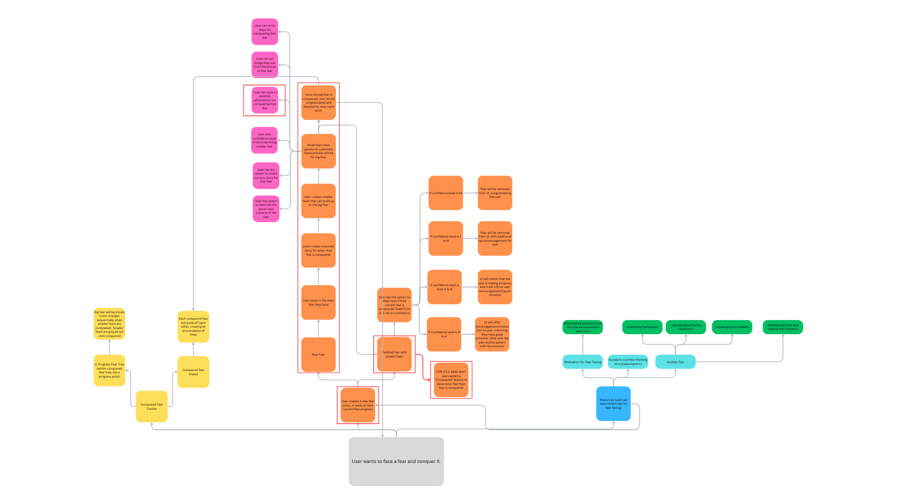
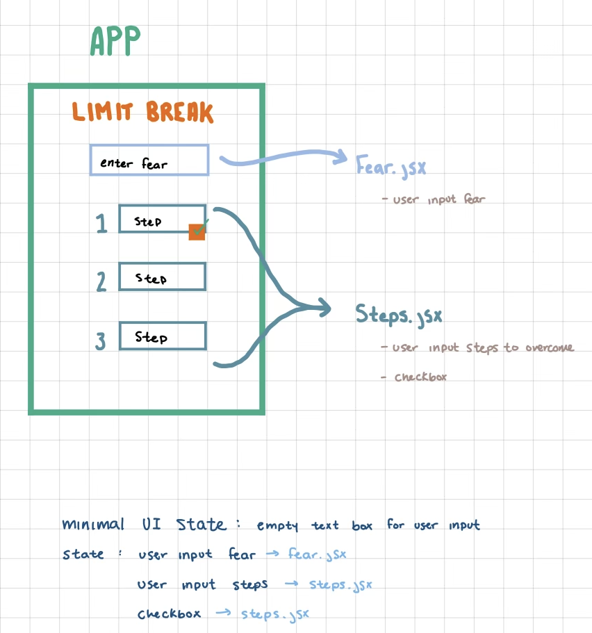

# pelletier-4630-project2
 
## Milestone 1

Members: Joey Pelletier, Alyssa Cady

Our project is called Limit Break. This will be a web app that can help out college students and young adults with facing substantial challenges/fears. The inspiration of this project comes from trying to overcome social anxiety and observations of flaws in existing apps (for example, some apps are scammy and want people to stay in the platform for more $$$, rather than actually solving their problems). This app's intention is to be a quick problem-solver rather than a money-hole platform.

This image shows the user flow of the map. Highlighted with a red border, are the items intended for MVP.

This image is the mood board for Limit Break's design. This contains the main menu and certain UI elements used in the app.

For resources, this website shows tips on facing fears (https://www.verywellmind.com/healthy-ways-to-face-your-fears-4165487), and this one demonstrates common thinking errors(https://www.holisticwellnesspractice.com/2021/12/26/17-common-thinking-errors-how-to-identify-and-replace-them).

In terms of my personal contributions, I will assist with the design of a Figma mockup, along with deciding what the final design elements will be for the app. I will either work on coding up the fear tree or the small fears and their customizable features.

In terms of goals,

Initial Prototype: Figma mockup and basic code-up (no css) of MVP app

MVP: Stylized app with functionalities surrounded by red border in the user flow (i.e. user can create big fear and its small fears, and add a description to the smaller fears, plus checkmarks for if they conquered the fear).

Stretch goals: Add other items from user flow, like the confidence numbers and a resources tab for example.

## Milestone 2

### Joey's Process

For steps 1, 3, and 4, of 'Thinking in React', we figured out a UI scheme with the planned actions of state. Essentially, our goal was to figure out how to implement the note-taking part of the app. The drawing is shown below:

